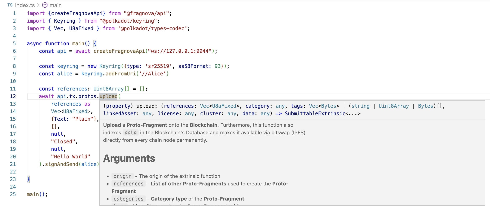

# `@fragnova/api`

`@fragnova/api`  provides you the function `createFragnovaApi()` which you can use to create a Polkadot.js API instance (https://polkadot.js.org/docs/api) that allows you to execute Fragnova's transactions (also known as "extrinsics") and RPCs. 

Here is how you can use it to create the Polkadot.js API instance in JavaScript:

```javascript
const {createFragnovaApi} = require("@fragnova/api");
const api = await createFragnovaApi("ws://127.0.0.1:9944");
```

## Using `@fragnova/api`

### Executing Extrinsics

If you want to execute the extrinsic `extrinsic` in the Fragnova Pallet `pallet`, you must follow the following format:

```javascript
api.tx.<pallet>.<extrinsic>;
```

#### Example

For example, if you want to execute the extrinsic `upload()` in the Fragnova Pallet `protos`, you can do so by typing `api.tx.protos.upload()`. 

If you are using an IDE like VSCode, you will also be able to see the following information:

- Expected Number of Arguments of the Extrinsic
- Expected Type of each Argument of the Extrinsic
- Documentation of the Extrinsic 

Below is a screenshot where you can see the aforementioned information using VSCode:

